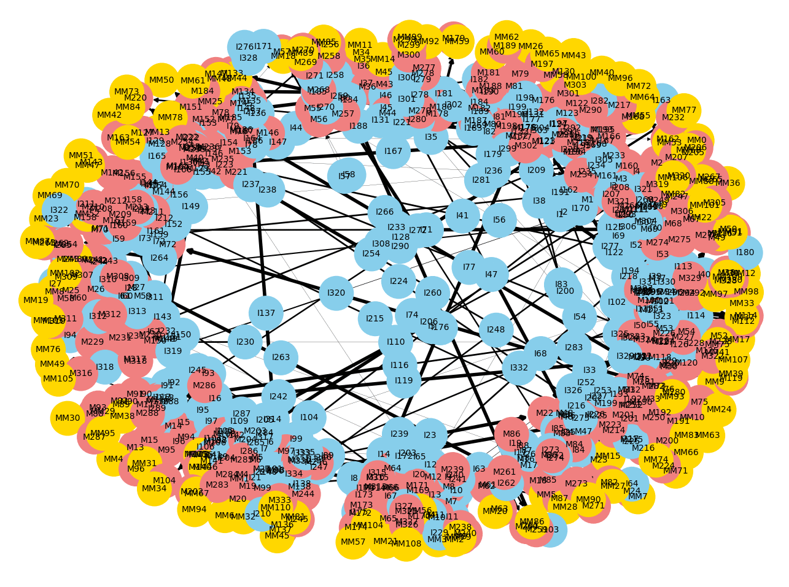

# Reflexive Logic System

A recursive-reflexive, adaptive logic simulation framework that models a self-consistent, contradiction-aware reasoning system. Inspired by cognitive architectures and meta-logic principles.



---

## 🔍 Features

- **Self-consistent logic generation**
- **Meta and meta-meta abstraction layers**
- **Trust-weighted connections (synaptic-like)**
- **Contradiction detection and pruning**
- **Goal-driven reinforcement mechanism**
- **CSV export of logic graph for external analysis**
- **Graph visualization with dynamic coloring and weights**

---

## 📁 File Overview

| File                                 | Description |
|--------------------------------------|-------------|
| `reflexive_logic_model_with_CSV_export.py` | Core simulation model with logic cycles and CSV export |
| `load_logic_graph_from_csv.py`             | Loader and visualizer for CSV-based logic graphs |
| `nodes.csv` (generated)                    | Exported list of all logic nodes (`id`, `type`, `value`) |
| `edges.csv` (generated)                    | Exported connections between nodes with `weight` values |
| `reflexive_logic_nodes_ORIGINAL.csv`       | Original base logic nodes |
| `reflexive_logic_edges_ORIGINAL.csv`       | Original base connections |

---

## ▶️ Running the Simulation

1. **Run the main model:**
   ```bash
   python reflexive_logic_model_with_CSV_export.py
   ```

   This generates:
   - `nodes.csv`
   - `edges.csv`

2. **Visualize the logic graph:**
   ```bash
   python load_logic_graph_from_csv.py
   ```

---

## 📊 Visualization

- **Sky Blue** → Input nodes  
- **Light Coral** → Meta nodes (first-order consistency checks)  
- **Gold** → Meta-meta nodes (higher-order patterns)

Edge thickness reflects **trust weight** (stronger = more reliable relation).

---

## 🧠 System Behavior

- Contradictions are not errors, but **signals for restructuring**.
- Goal bias promotes or demotes trust in reasoning pathways.
- Self-reinforcing patterns evolve into stable axioms.
- Reflexivity enables logic rules to be altered by experience.

---

## 📜 License

This project is licensed under the [Creative Commons Attribution-NonCommercial 4.0 International License](https://creativecommons.org/licenses/by-nc/4.0/).

You are free to share and adapt the code for personal, academic, or non-commercial use, provided that you:
- Attribute the original author
- Link back to this repository
- Indicate any changes made

## 🚫 Commercial Use
Use of this codebase in **commercial applications** or **for-profit systems** requires explicit permission and licensing.  
For licensing requests or custom collaboration, contact:

Tim Isabella
[GitHub Profile](https://github.com/TimIsabella)
https://www.linkedin.com/in/timisabella

---

## ✨ Author

Tim Isabella
[GitHub Profile](https://github.com/TimIsabella)
https://www.linkedin.com/in/timisabella
